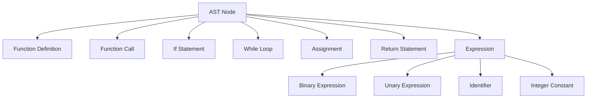

# Custom Compiler Project

This project implements a custom compiler for C-- Subset of C programming language. The compiler performs lexical analysis, parsing, semantic analysis, and code generation, translating the source code into MIPS assembly.

## Project Structure

The compiler is composed of several key components:

1. **Lexical Analyzer (Scanner)**: Defined in `scanner.c` and `scanner.h`
2. **Parser**: Implemented in `parser.c`
3. **Abstract Syntax Tree (AST)**: Structures defined in `ast.h`
4. **Semantic Analyzer**: Implemented in `semantic.c`
5. **Code Generator**: Implemented in `gen_code.c` and `gen_code.h`
6. **MIPS Assembly Generator**: Implemented in `mips_gen.c`

## Key Data Structures

### Abstract Syntax Tree (AST)

The AST is the core data structure used to represent the parsed program. It uses different node types for various language constructs:



### Three-Address Code (3AC)

The compiler uses an intermediate representation called Three-Address Code:

```c
typedef struct ThreeAddrInstr {
    OpCode op;
    char* arg1;
    char* arg2;
    char* result;
    struct ThreeAddrInstr* next;
    int ArgCount;
    char** argnames;
} ThreeAddrInstr;
```

### Symbol Table

A symbol table is used to track variables and functions:

```c
typedef struct {
    char* name;
    IdType type;
    int argCount;
} SymbolTableEntry;

typedef struct {
    SymbolTableEntry* entries;
    int size;
    int capacity;
} SymbolTable;
```

## Compilation Process

1. **Lexical Analysis**: The scanner tokenizes the input.
2. **Parsing**: The parser constructs an AST from the tokens.
3. **Semantic Analysis**: The semantic analyzer checks for type errors and other semantic issues.
4. **Intermediate Code Generation**: The AST is translated into 3AC.
5. **MIPS Code Generation**: The 3AC is translated into MIPS assembly.

## Building and Running

Use the provided Makefile to build the project:

```
make
```

Run the compiler with various flags:

```
./compile --chk_decl --print_ast --gen_code
```

## Skills Demonstrated

- Advanced data structures (AST, Symbol Table)
- Compiler design principles
- Code generation techniques
- MIPS assembly knowledge
- C programming
- Software architecture

Note: This README provides a high-level overview. For detailed implementation specifics, please refer to the individual source files.

